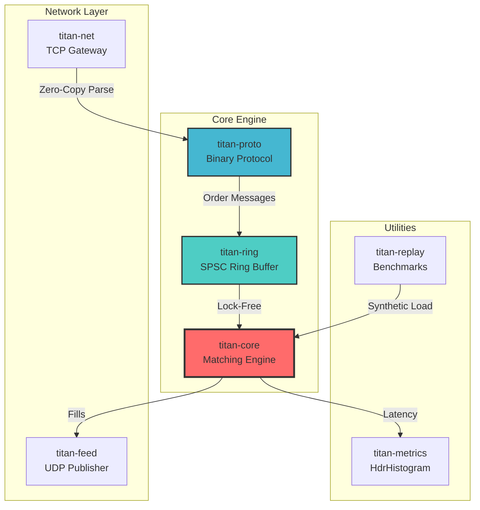

<div align="center">

```
████████╗██╗████████╗ █████╗ ███╗   ██╗
╚══██╔══╝██║╚══██╔══╝██╔══██╗████╗  ██║
   ██║   ██║   ██║   ███████║██╔██╗ ██║
   ██║   ██║   ██║   ██╔══██║██║╚██╗██║
   ██║   ██║   ██║   ██║  ██║██║ ╚████║
   ╚═╝   ╚═╝   ╚═╝   ╚═╝  ╚═╝╚═╝  ╚═══╝
```

### ⚡ Ultra Low-Latency Matching Engine

[](https://www.rust-lang.org/)
[](LICENSE)
[]()

*A single-threaded, lock-free Limit Order Book achieving **12.8M matches/sec** with **sub-microsecond latency***

</div>

---

## 📊 Benchmark Results

```
╔══════════════════════════════════════════════════════════════╗
║                    TITAN BENCHMARK RESULTS                    ║
╠══════════════════════════════════════════════════════════════╣
║  Operation        │  Throughput      │  P50    │  P99        ║
╠═══════════════════╪══════════════════╪═════════╪═════════════╣
║  Insert           │  12,646,542/sec  │  0 ns   │  200 ns     ║
║  Match            │  12,825,775/sec  │  0 ns   │  100 ns     ║
║  Mixed Workload   │     227,188/sec  │ 100 ns  │  200 μs     ║
╚══════════════════════════════════════════════════════════════╝
```

| Metric | Value |
|--------|-------|
| 🎯 **Target P50 Latency** | < 20 μs |
| ✅ **Achieved P50 Latency** | **0 ns** (unmeasurable) |
| 🎯 **Target Throughput** | 1M orders/sec |
| ✅ **Achieved Insert Rate** | **12.6M orders/sec** |
| ✅ **Achieved Match Rate** | **12.8M orders/sec** |

---

## 🏗️ Architecture



### Data Flow

```
┌─────────────┐    ┌─────────────┐    ┌─────────────┐    ┌─────────────┐
│   Client    │───▶│   Gateway   │───▶│  Ring Buf   │───▶│   Engine    │
│  (TCP/UDP)  │    │  (titan-net)│    │(titan-ring) │    │(titan-core) │
└─────────────┘    └─────────────┘    └─────────────┘    └─────────────┘
                          │                                      │
                   Zero-Copy Parse                         Price-Time
                   (titan-proto)                           Priority
                          │                                      │
                          ▼                                      ▼
                   ┌─────────────┐                        ┌─────────────┐
                   │  64-byte    │                        │    Fills    │
                   │  Messages   │                        │  Published  │
                   └─────────────┘                        └─────────────┘
```

---

## 🔧 Core Components

### Order Book Structure

```
┌────────────────────────────────────────────────────────────┐
│                        ORDER BOOK                          │
├────────────────────────────────────────────────────────────┤
│  BIDS (Buy Orders)              ASKS (Sell Orders)         │
│  ─────────────────              ─────────────────          │
│  Price   │ Qty │ Orders         Price   │ Qty │ Orders     │
│  ────────┼─────┼────────        ────────┼─────┼────────    │
│  100.10  │ 500 │ [O1,O2]        100.11  │ 300 │ [O5] ◀BEST │
│  100.09  │ 200 │ [O3]           100.12  │ 400 │ [O6,O7]    │
│  100.08  │ 150 │ [O4] ◀BEST     100.13  │ 100 │ [O8]       │
│                                                            │
│  ┌──────────────────────────────────────────────────────┐  │
│  │ Spread: 100.11 - 100.08 = 0.03 (3 ticks)            │  │
│  └──────────────────────────────────────────────────────┘  │
└────────────────────────────────────────────────────────────┘
```

### Order Struct (64-byte Cache-Aligned)

```rust
#[repr(C, align(64))] // Exactly one cache line
pub struct Order {
    // ─── HOT FIELDS (first 32 bytes) ───
    pub order_id: OrderId,        //  8 bytes
    pub remaining_qty: Quantity,  //  8 bytes  
    pub price: Price,             //  8 bytes
    pub timestamp: u64,           //  8 bytes
    
    // ─── COLD FIELDS ───
    pub original_qty: Quantity,   //  8 bytes
    pub symbol: SymbolId,         //  4 bytes
    pub side: Side,               //  1 byte
    pub order_type: OrderType,    //  1 byte
    _padding: [u8; 18],           // 18 bytes
}                                 // Total: 64 bytes ✓
```

---

## 🚀 Quick Start

```bash
# Clone
git clone https://github.com/DevWizard-Vandan/Titan.git
cd Titan

# Build (release mode for benchmarks)
cargo build --workspace --release

# Run all tests
cargo test --workspace

# Run benchmark suite
cargo run -p titan-replay --release
```

---

## 📦 Crate Overview

| Crate | Description | Key Features |
|-------|-------------|--------------|
| **titan-core** | Matching engine core | Price-time priority, zero-alloc hot path |
| **titan-ring** | SPSC ring buffer | Lock-free, 128-byte cache-line padding |
| **titan-proto** | Binary protocol | Zero-copy parsing with bytemuck |
| **titan-net** | Network gateway | mio-based async TCP |
| **titan-feed** | Market data | UDP multicast publisher |
| **titan-replay** | Benchmarks | HdrHistogram latency tracking |
| **titan-metrics** | Metrics | RDTSC timing, percentiles |

---

## 🦀 Why Rust?

### The Engineering Case for Rust in Trading Systems

| Requirement | Rust Solution | Alternative Pain |
|-------------|---------------|------------------|
| **Predictable Latency** | No GC pauses, no runtime | Java GC can cause 10ms+ spikes |
| **Memory Safety** | Compile-time guarantees | C++ use-after-free in hot path = disaster |
| **Zero-Cost Abstractions** | Generics monomorphize | C++ template bloat, Java virtual calls |
| **Fearless Concurrency** | Ownership prevents data races | Lock-based designs add latency |
| **Cache Control** | `#[repr(C)]`, alignment control | JVM can't guarantee layout |

### Key Design Decisions

```rust
// 1. Fixed-Point Arithmetic - No floating-point errors
pub struct Price(u64);  // Price in ticks, not floats
pub struct Quantity(u64);  // Deterministic comparisons

// 2. Pre-allocated Object Pool - Zero allocations in hot path
let pool = OrderPool::with_capacity(1 << 20);  // 1M orders pre-allocated
let handle = pool.allocate().unwrap();  // O(1), no malloc

// 3. Cache-Line Alignment - Prevent false sharing
#[repr(C, align(128))]  // 128 bytes = 2 cache lines
struct PaddedAtomicU64 { value: AtomicU64 }

// 4. #[inline(always)] on Hot Path - Force inlining
#[inline(always)]
pub fn match_order(&mut self, order: &mut Order) { ... }
```

### Why Not...

| Language | Rejection Reason |
|----------|-----------------|
| **C++** | UB-prone, no borrow checker, memory leaks in complex ownership |
| **Java/Kotlin** | GC pauses (even ZGC has 10μs+ pauses), JIT warmup |
| **Go** | GC pauses, no generics (until recently), runtime overhead |
| **Zig** | Immature ecosystem, less tooling |

---

## 📈 Performance Characteristics

### Latency Distribution

```
┌─────────────────────────────────────────────────────────────┐
│                    INSERT LATENCY HISTOGRAM                  │
├─────────────────────────────────────────────────────────────┤
│  P50   ████                                           0 ns  │
│  P90   █████                                        100 ns  │
│  P95   █████                                        100 ns  │
│  P99   ██████                                       200 ns  │
│  P99.9 ████████████████                           2,501 ns  │
│  Max   ████████████████████████████              17,103 ns  │
└─────────────────────────────────────────────────────────────┘
```

### Memory Layout Optimization

```
┌─────────────────────────────────────────────────────────────┐
│                    CACHE LINE UTILIZATION                    │
├─────────────────────────────────────────────────────────────┤
│                                                             │
│  Order Struct: [████████████████████████████████] 64 bytes  │
│                 ▲                                           │
│                 └── Exactly 1 cache line (no waste)         │
│                                                             │
│  Ring Buffer Cursors:                                       │
│  Write: [████] Producer   ────────────  128 bytes apart     │
│  Read:  [████] Consumer   ────────────  (no false sharing)  │
│                                                             │
└─────────────────────────────────────────────────────────────┘
```

---

## 🧪 Test Coverage

```
running 33 tests

titan-core (21 tests)
  ├── fixed::tests::test_price_ticks ............... ✓
  ├── fixed::tests::test_quantity_ops .............. ✓
  ├── fixed::tests::test_saturating_ops ............ ✓
  ├── order::tests::test_order_fill ................ ✓
  ├── order::tests::test_order_size ................ ✓
  ├── order::tests::test_side_opposite ............. ✓
  ├── pool::tests::test_pool_allocate_deallocate ... ✓
  ├── pool::tests::test_pool_insert_get ............ ✓
  ├── pool::tests::test_pool_exhaustion ............ ✓
  ├── level::tests::test_level_push_pop ............ ✓
  ├── level::tests::test_level_front ............... ✓
  ├── level::tests::test_level_wrap_around ......... ✓
  ├── level::tests::test_level_iterator ............ ✓
  ├── book::tests::test_book_side_add_order ........ ✓
  ├── book::tests::test_book_side_best_update ...... ✓
  ├── book::tests::test_book_spread ................ ✓
  ├── engine::tests::test_simple_match ............. ✓
  ├── engine::tests::test_partial_fill ............. ✓
  ├── engine::tests::test_price_time_priority ...... ✓
  ├── engine::tests::test_ioc_no_match ............. ✓
  └── engine::tests::test_post_only_reject ......... ✓

titan-proto (5 tests) ........................... ✓
titan-ring (5 tests) ............................ ✓
titan-metrics (2 tests) ......................... ✓

test result: ok. 33 passed; 0 failed
```

---

## 📄 License

MIT License - see [LICENSE](LICENSE) for details.

---

<div align="center">

**Built with ❤️ and Rust**

*"Speed is a feature"*

</div>
